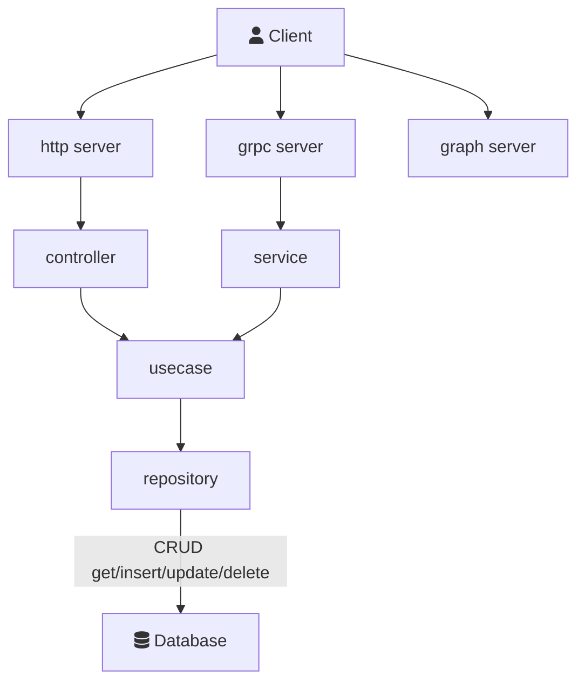

# Clean Architect layout

در این رپو ما یک نمونه layout درخصوص معماری کلین قرار دادیم و هر بخش را توضیح دادیم.

```mermaid
graph TD
A[fa:fa-user Client]
A --> B[http server]
A --> C[grpc server]
A --> D[graph server]

B --> E[controller]
C --> F[service]
E --> G[usecase]
F --> G[usecase]

G --> H[repository]
H --> |CRUD get/insert/update/delete| I[fa:fa-database Database]
  
```
